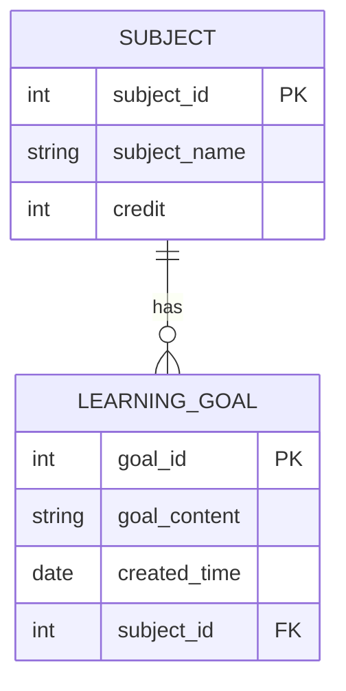

```mermaid
erDiagram
    SUBJECT ||--o{ LEARNING_GOAL : "has"

    SUBJECT {
        int subject_id PK
        string subject_name
        int credit
    }

    LEARNING_GOAL {
        int goal_id PK
        string goal_content
        date created_time
        int subject_id FK
    }

```
