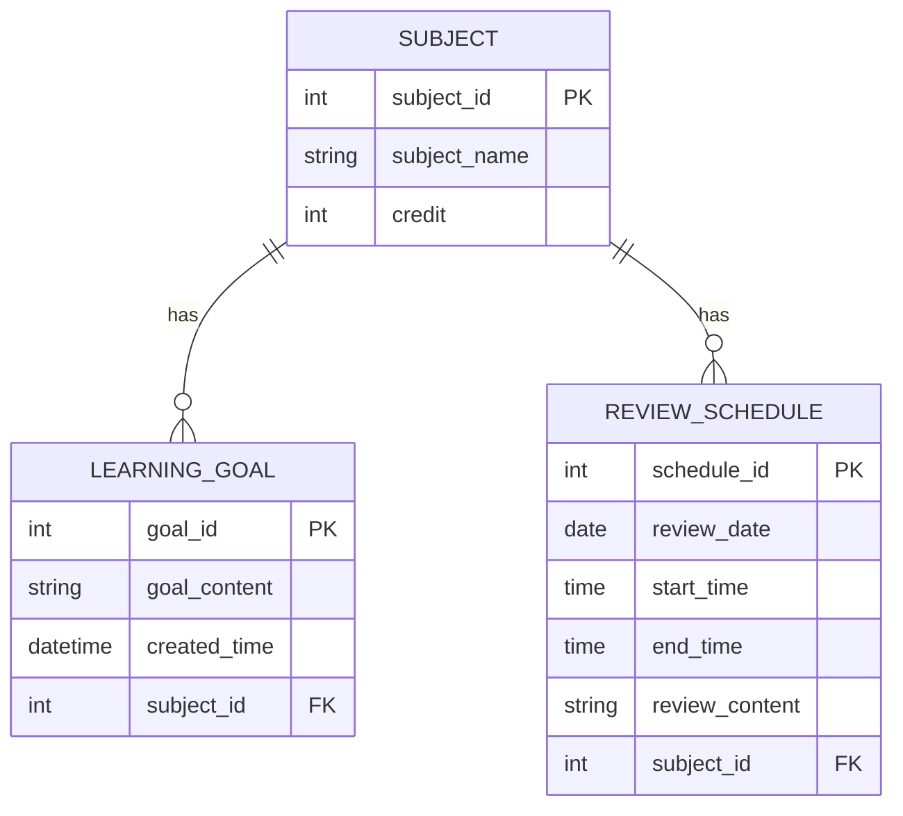

```mermaid
erDiagram
    SUBJECT ||--o{ LEARNING_GOAL : has
    SUBJECT ||--o{ REVIEW_SCHEDULE : has

    SUBJECT {
        int subject_id PK
        string subject_name
        int credit
    }

    LEARNING_GOAL {
        int goal_id PK
        string goal_content
        datetime created_time
        int subject_id FK
    }

    REVIEW_SCHEDULE {
        int schedule_id PK
        date review_date
        time start_time
        time end_time
        string review_content
        int subject_id FK
    }

```
