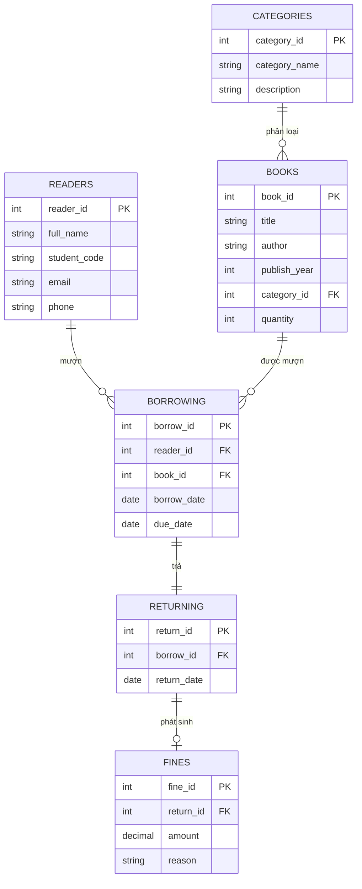

```mermaid
erDiagram
    CATEGORIES ||--o{ BOOKS : "phân loại"
    READERS ||--o{ BORROWING : "mượn"
    BOOKS ||--o{ BORROWING : "được mượn"
    BORROWING ||--|| RETURNING : "trả"
    RETURNING ||--o| FINES : "phát sinh"

    CATEGORIES {
        int category_id PK
        string category_name
        string description
    }

    BOOKS {
        int book_id PK
        string title
        string author
        int publish_year
        int category_id FK
        int quantity
    }

    READERS {
        int reader_id PK
        string full_name
        string student_code
        string email
        string phone
    }

    BORROWING {
        int borrow_id PK
        int reader_id FK
        int book_id FK
        date borrow_date
        date due_date
    }

    RETURNING {
        int return_id PK
        int borrow_id FK
        date return_date
    }

    FINES {
        int fine_id PK
        int return_id FK
        decimal amount
        string reason
    }

```
